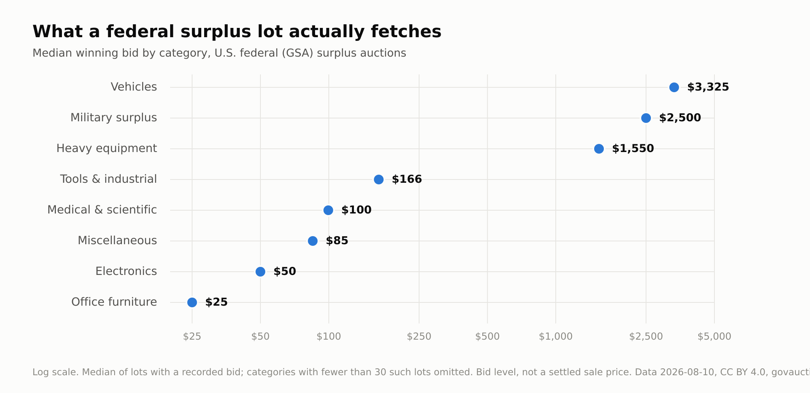
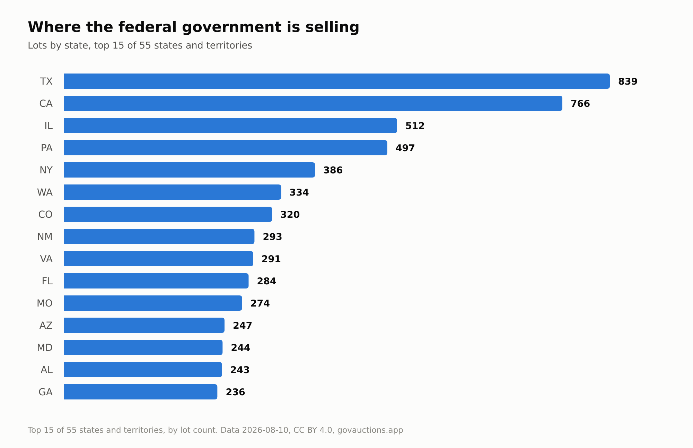

# U.S. Government (GSA) Surplus Auction Dataset

A free, open dataset of completed **U.S. federal surplus auction lots** sold
through [GSA Auctions](https://gsaauctions.gov), aggregated by
[GovAuctions](https://govauctions.app).

- **Rows:** 10,015 lots
- **Date range (auction end):** 2026-05-06 → 2026-08-07
- **States/territories:** 55
- **Categories:** 11
- **Lots with a recorded bid:** 6,398
- **Generated:** 2026-08-10
- **Schema version:** 1.0
- **License:** [CC-BY-4.0](./LICENSE) — free to use **with attribution to GovAuctions (https://govauctions.app)**

## Why this is safe to publish openly

GSA is a U.S. federal agency, so these listings are works of the U.S. government
and are **not subject to copyright** (17 U.S.C. §105). GSA is also a source we
index with explicit sanction. The dataset is **data only — no images** — and
contains no personal information (sellers are federal agencies).

## Files

| File | Description |
|------|-------------|
| `us-gsa-surplus-auctions.csv`  | Lot-level data, CSV (RFC-4180) |
| `us-gsa-surplus-auctions.json` | Lot-level data, JSON array |
| `manifest.json` | Machine-readable metadata (counts, range, schema, license) |

## Data dictionary

| Column | Type | Notes |
|--------|------|-------|
| `id` | string | Stable GovAuctions/GSA lot id |
| `title` | string | Lot title (federal work, public domain) |
| `category` | string | Normalized category (see list below) |
| `condition` | string | Condition as reported by GSA, when present |
| `seller_type` | string | Selling level (e.g. `federal`) |
| `state` | string | Lot location, 2-letter state/territory |
| `city` | string | Lot location city, when present |
| `zip` | string | Lot location ZIP, when present |
| `currency` | string | Always `USD` |
| `starting_bid` | number | Opening/list price. **Currently empty for every row** — GSA does not expose an opening price on the listings we collect. Kept for schema stability; do not treat a blank as $0. |
| `current_or_final_bid` | number | **Bid level, not a guaranteed sale price** (see below) |
| `bid_count` | number | Number of bids observed (GSA bid counts are reliable) |
| `buyer_premium_pct` | number | Buyer's premium percentage, when applicable |
| `sold` | enum | `true` / `false` / `unknown` — derived; `unknown` when undeterminable |
| `ended_at` | date | Auction end date (`YYYY-MM-DD`, UTC) |
| `source_url` | string | Link to the original GSA listing |

**Categories:** `electronics`, `heavy-equipment`, `jewelry`, `medical-scientific`, `military-surplus`, `miscellaneous`, `office-furniture`, `real-estate`, `seized-property`, `tools-industrial`, `vehicles`

## Important caveat on price

`current_or_final_bid` is the **current or last-observed bid**, not a confirmed
hammer price. Treat it as a *bid level*. Auction prices are heavily
right-skewed, so medians are more meaningful than means. Use the `sold` flag to
filter to lots with a positive sale signal where you need one.

## Cite this dataset

> GovAuctions (https://govauctions.app), "U.S. Government (GSA) Surplus Auction Dataset," 2026-08-10.
> Source: https://govauctions.app/research/state-of-government-surplus

Updated monthly. Issues and pull requests welcome.
